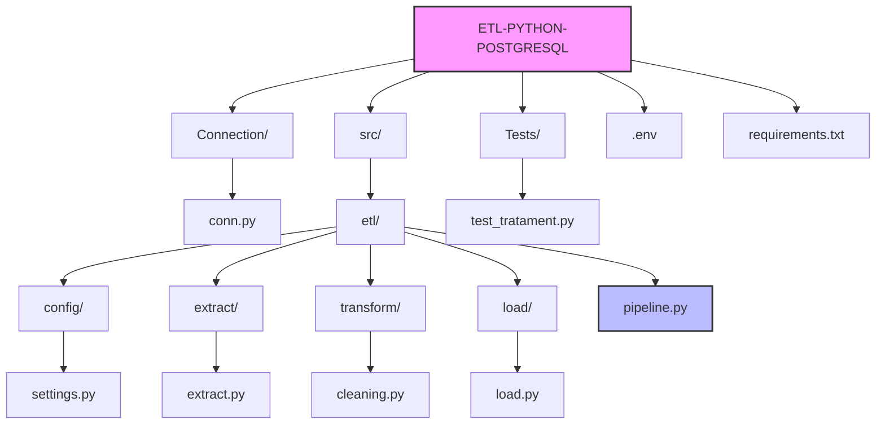

Technical Documentation: ETL Pipeline (Python & PostgreSQL)

1. Project Overview
    This project implements a robust Data Engineering pipeline for processing e-commerce data. It automates the extraction of raw records from a PostgreSQL database, 
    performs deep data cleaning and normalization using Pandas, and exports high-quality datasets to CSV format for downstream analysis.

2. Project Architect

 
4. Data Quality & Transformation Rules

        The pipeline applies several "Silver-layer" transformations to ensure data integrity:
        Customer Data Processing

            Deduplication: Removes duplicate entries based on customer_id.

            Contact Normalization: Standardizes phone numbers using Regex and cleanses email formats.

            Imputation: Fills missing phone, email, and status fields with default values.

            Date Validation: Identifies and corrects invalid birth dates to ensure chronological consistency.

  Order Data Processing

    Financial Sane-checking: Converts amount fields to float and handles negative or outlier values.

    Status Standardization: Normalizes payment methods and order statuses for unified reporting.

    Date Handling: Fills missing order dates to maintain time-series accuracy.

4. Environment Setup

    The project relies on a .env file located in the root directory for secure credential management:

        DB_NAME=YourDatabase
        DB_USER=YourUser
        DB_PASSWORD=YourPassword
        DB_HOST=localhost
        DB_PORT=YourPort

        INPUT_PATH=data/input
        OUTPUT_PATH=data/output

5. Execution Instructions

    To ensure all internal modules are correctly discovered by the Python interpreter, run the pipeline from the project root:

       1. Install dependencies
         pip install -r requirements.txt

       2. Set the Python Path (Windows PowerShell)
         $env:PYTHONPATH += ";$(Get-Location)\src"

       3. Execute the pipeline
       python src/etl/pipeline.py

6. Technical Stack

         Category,Tool / Library
         Language,Python 3.10+
         Data Processing,Pandas
         Database,PostgreSQL
         Settings Management,Pydantic-Settings
         Automation,Makefile

